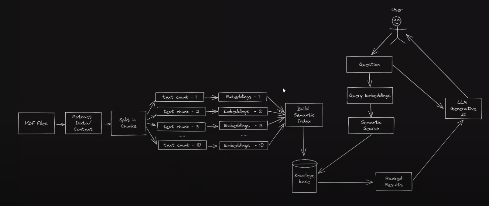

# Research Paper Assistant

This project provides a blueprint for a research paper assistant, inspired by platforms like ASCO Publications (https://ascopubs.org/), Google Scholar (https://scholar.google.com/), and ChatGPT, designed to help researchers obtain richer insights from research papers. Built as a federated GraphQL microservices system using Strawberry with Python, this setup leverages S3, Postgres, LangChain, OpenSearch, and OpenAI to deliver robust search, summarization, and document management functionalities.



## Project Overview

The assistant allows users to upload research papers, index their contents, and perform intelligent queries on the data. The architecture consists of microservices that individually handle tasks such as file management and content indexing, unified through GraphQL Federation. This setup ensures modularity, scalability, and efficient handling of research data.

### Microservices

1. **System 1: File Management Service**
   - **Purpose:** Upload and manage PDF files.
   - **Functionality:** Supports uploading of one or multiple PDFs to S3, stores metadata in Postgres, and lists uploaded files.
   - **Libraries & Dependencies:** Strawberry (GraphQL), boto3 (S3 integration), sqlalchemy, psycopg2-binary (Postgres), fastapi.
   - **Environment Variables:**
     - `DATABASE_URL`: PostgreSQL connection string.
     - `AWS_ACCESS_KEY_ID`, `AWS_SECRET_ACCESS_KEY`, `BUCKET_NAME`: For S3 integration.
   - **Docker Configuration:**
     - Service runs on port `8081`.
     - Depends on the `db` service (Postgres).
     - Networked via `backend-network`.

2. **System 2: PDF Indexing and Querying Service**
   - **Purpose:** Index PDF content and support intelligent querying and summarization.
   - **Functionality:**
     - Indexes PDF content with LangChain and stores it in OpenSearch.
     - Provides summaries of PDFs using OpenAI's API.
     - Allows users to search and interact with the stored content.
   - **Libraries & Dependencies:** Strawberry (GraphQL), langchain, opensearch-py, openai, fastapi.
   - **Environment Variables:**
     - `OPENSEARCH_URL`: OpenSearch connection URL.
     - `OPENAI_API_KEY`: API key for OpenAI.
     - S3 environment variables shared with File Management Service.
   - **Docker Configuration:**
     - Service runs on port `8082`.
     - Depends on `opensearch` and `service1`.
     - Networked via `backend-network`.


### Federation Setup

The microservices expose GraphQL schemas using `strawberry.federation` for a unified federated graph. A GraphQL Gateway (e.g., Apollo Gateway) can be used to combine the schemas into a single endpoint, facilitating seamless queries across services.

- **Federation Libraries**: strawberry.federation
- **Gateway Options**: Apollo Gateway or compatible GraphQL gateway service

This federated setup allows each service to operate independently, contributing specific capabilities to the overall system while enabling a cohesive API experience for the user.

### Prerequisites

- **Docker** for containerization.
- **Postgres** (set up through Docker) for metadata storage.
- **S3 Bucket** for PDF storage.
- **OpenSearch** (set up through Docker) for vector storage and retrieval.
- **OpenAI API** for summarization.

### Setup and Configuration

1. **Clone the Repository**
   ```bash
   git clone https://github.com/ntt2k/smart-reader.git
   cd smart-reader
   ```

2. **Environment Variables**
   Set up a `.env` file in the root directory with the following variables:
   ```bash
   AWS_ACCESS_KEY_ID=your_access_key
   AWS_SECRET_ACCESS_KEY=your_secret_key
   BUCKET_NAME=your_bucket_name
   DATABASE_URL=postgresql+asyncpg://user:password@db:5432/pdfs
   OPENSEARCH_URL=http://opensearch:9200
   OPENAI_API_KEY=your_openai_api_key
   ```

3. **Docker Compose Setup**
   Use `docker-compose` to build and run the services:
   ```bash
   docker-compose up --build
   ```

### Services and Ports

- **Service 1: File Management Service**: http://localhost:8081
- **Service 2: PDF Indexing and Querying Service**: http://localhost:8082
- **OpenSearch Dashboard**: http://localhost:5601

### Usage

1. **File Uploading**: Upload PDFs through the File Management Service.
2. **Indexing and Summarization**: The PDF Indexing Service automatically indexes uploaded PDFs and generates summaries.
3. **Querying**: Use the federated GraphQL API to ask questions, retrieve document summaries, or perform semantic searches.

